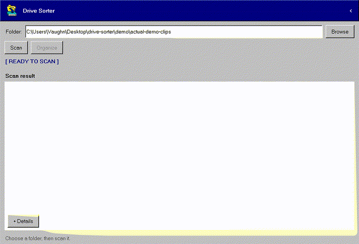

# Drive Sorter

Drive Sorter is a Windows desktop utility that organizes game clips using video metadata. It reads the game title and creation year with FFprobe, previews every planned move, and sorts clips into:

```text
Organized/<Game>/<Year>/
```

Clips without a usable game title remain in `Organized/Unsorted` until they are manually identified.



## Download

Download the latest Windows installer or portable ZIP from [GitHub Releases](https://github.com/vaughnmcmanamna/drive-sorter/releases). Release packages include Python, Tkinter, FFmpeg, and FFprobe.

The current Windows packages are unsigned, so Microsoft Defender SmartScreen may show a warning. Verify the download against the published `SHA256SUMS.txt` before running it.

## Requirements

- Windows
- Python 3.11 or newer with Tkinter
- `ffmpeg` and `ffprobe` available on `PATH`

Those requirements apply only when running from source.

## Running the app

Double-click `launch_drive_sorter.pyw`, or run:

```powershell
python gui.py
```

The folder field starts empty so the app cannot accidentally scan its installation or test directory. Choose the folder containing your clips, select **Scan**, review the proposed destinations, and select **Organize**. No files move until the confirmation dialog is accepted.

## Manual clip review

`Review unsorted (N)` includes unknown clips from the current scan and clips already inside `Organized/Unsorted`. The reviewer shows a still frame and offers game folders detected during the scan or already present under `Organized`.

Keyboard controls:

- `Up` / `Down`: select a game.
- `Enter`: assign the selected game and open the next clip.
- The next clip keeps that game selected; one arrow press moves to the adjacent game.
- Start typing: filter existing games or enter a new game name. Enter assigns the typed name unless you explicitly choose a filtered result with Up/Down.
- `Ctrl+Left`: return to the previous clip.
- `Ctrl+Right`: skip the current clip.
- `Escape`: close the reviewer.

Dragging the preview onto a game and button-based assignment remain available.

Manual assignments create a normal move plan. They still require confirmation and use the same collision checks and undo journal as automatically detected clips.
New game folders are created only when that follow-up plan is organized.

## Safety behavior

- Existing files are never intentionally overwritten.
- Same-run duplicate destinations are detected case-insensitively.
- Optional duplicate renaming assigns numeric suffixes, including when a destination already exists.
- Destinations are checked again immediately before moving.
- A metadata or move failure for one clip does not stop the remaining clips.
- FFprobe calls time out after 30 seconds.
- The latest successful Organize or Flatten operation can be undone safely.
- Cache failures do not stop scans; undo-journal failures produce a visible warning without misrepresenting the move result.
- Changing the selected folder immediately clears the old scan plan, preventing clips from being organized against the wrong folder.
- Drive Sorter prevents the main window from closing while a file operation is still being finalized.
- Cache and Undo state are stored under the current user's local application-data directory. Existing project-local state is read and migrated automatically.

## Empty-folder cleanup

Open **Tools** and select **Remove empty folders** to preview empty folders anywhere beneath the selected folder. The app asks for confirmation, removes folders from the deepest level upward, and rechecks each one immediately before removal. The selected folder, files, non-empty folders, links, and junctions are never removed.

This cleanup intentionally has no Undo action: no files are changed, and the confirmation preview appears before removal.

## Test fixtures

Canonical manual-review clips live in `test-fixtures/manual-review-samples`. Restore disposable working copies after they have been organized with:

```powershell
python tools/reset_test_fixtures.py
```

The three clips intentionally contain no game title or creation timestamp, so they exercise the complete manual-review workflow.

## Tests

```powershell
python -m unittest -v
```

The current suite contains 43 tests covering metadata parsing, scanning, caching, cancellation, bundled-tool discovery and verification, planning, duplicate handling, source revalidation, file moves, flattening, empty-folder cleanup, persistent Unsorted review, state migration, and undo.

Additional architecture and product decisions are documented under [`docs/`](docs/).

Contributions are welcome. See [CONTRIBUTING.md](CONTRIBUTING.md) for the development workflow and [SECURITY.md](SECURITY.md) for reporting security problems.

Release history is recorded in [CHANGELOG.md](CHANGELOG.md).

## Building a Windows release

On 64-bit Windows, install Inno Setup 6 and run:

```powershell
.\tools\build_release.ps1
```

This creates a portable ZIP, a standard per-user installer, the corresponding FFmpeg source archive, and SHA-256 checksums under `release`. Build dependencies and FFmpeg are pinned and downloaded into ignored local directories. See [`docs/releasing.md`](docs/releasing.md) for signing, clean-machine testing, versioning, and GitHub release instructions.

Drive Sorter processes clips locally and contains no telemetry or upload feature.

## License

Drive Sorter is open-source software released under the [MIT License](LICENSE). FFmpeg remains subject to its separate GPLv3 terms described in [THIRD_PARTY_NOTICES.md](THIRD_PARTY_NOTICES.md).
